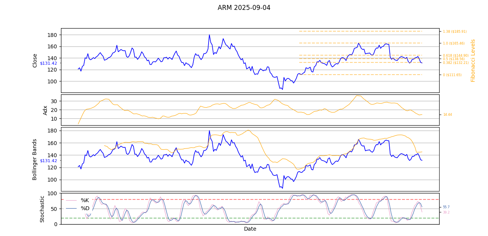

# Signal Helper: Stock Technical Indicator Analyzer

[](https://www.python.org/downloads/)
[](LICENSE)

## Overview

Signal Helper is a Python-based tool for analyzing stock market data using various technical indicators. It fetches historical stock prices via Yahoo Finance (yfinance), calculates indicators like SMA, RSI, MACD, Bollinger Bands, and more, and generates visualizations with overlaid plots. The tool also assesses market sentiment (Bullish, Volatile, Bearish) based on the VIX index and highlights key conditions for watch indicators.

Key features:
- Supports multiple technical indicators with configurable periods and plotting options.
- Market sentiment analysis using VIX thresholds.
- Multi-ticker support via environment variables.
- Efficient memory usage with garbage collection and data type optimizations.
- Customizable plotting with subplots, legends, and Fibonacci retracement levels.

This tool is designed for traders and analysts to quickly visualize stock trends and make informed decisions.

## Installation

### Prerequisites
- Python 3.12+
- Git (optional, for cloning the repository)

### Steps
1. Clone the repository:
   ```
   git clone https://github.com/pinshengjuan/python-stock-technical-indicator-analyzer
   cd python-stock-technical-indicator-analyzer
   ```

2. Install dependencies from `requirements.txt`:
   ```
   pip install -r requirements.txt
   ```

   Dependencies include:
   - python-dotenv==1.1.0
   - numpy==1.26.4
   - pandas==2.2.2
   - matplotlib==3.10.5
   - seaborn==0.13.2
   - pydantic==2.9.2
   - pytest==8.3.3
   - yfinance==0.2.59
   - beautifultable==1.1.0

3. Set up environment variables in `.env` (example provided in the repo):
   ```
   TICKER_LIST='ARM,GOOGL,NVDA'  # Comma-separated list of stock tickers
   DAYS=365  # Number of days of historical data to fetch
   BETA='0.8,1.2'  # Optional beta range (not used in current version)
   ```

## Usage

### Running the Tool
Execute the main script:
```
python app.py
```

- The script will:
  - Fetch historical data for each ticker in `TICKER_LIST`.
  - Calculate technical indicators based on `config_plot.json`.
  - Determine market sentiment (Bullish, Volatile, Bearish) using VIX from `market_sentiment.json`.
  - Print sentiment conditions in a table format.
  - Generate and display plots for each ticker, saving data to `./data/` if needed.

- Output includes:
  - Console: Market sentiment, VIX value, and condition table.
  - Plots: Interactive Matplotlib figures with price charts, indicators, and labels.
  - Files: Optional data dumps in `./data/` (e.g., for debugging).

### Example Output
- Console example for Bullish market:
  ```
  Bullish Market, vix: 18.5
  +================+====================================+
  |   Indicators   |            Requirements            |
  +================+====================================+
  | Stochastic %K  |       %K line above %D line        |
  +----------------+------------------------------------+
  |     ADX 14     |            ADX(14) > 15            |
  +----------------+------------------------------------+
  | Bollinger-Band |      Price hit the upper band      |
  +----------------+------------------------------------+
  |   Fibonacci    | Price breaks above the 0.618 level |
  +----------------+------------------------------------+
  ...
  ```

- Plots: Multi-subplot figures showing price, volume, RSI, MACD, etc., with latest values labeled.

### Sample Plot
Below is an example plot generated for the ticker `ARM` as of September 04, 2025:


### Customization
- **Indicators and Plotting**: Edit `config_plot.json` to activate/deactivate indicators, adjust periods, colors, and subplot positions.
  - Example snippet:
    ```json
    {
      "name": "bollinger-bands",
      "periods": 20,
      "deviations": 2,
      "plot": {
        "active": true,
        "add_price_chart": true,
        "subplot_position": 6,
        "h_ratio": 6,
        "series": [
          {"type": "line", "label": "Upper Band", "y_key": "upper_band", "color": "#ffa500", "legend": false, "mark_value": false},
          {"type": "line", "label": "Middle Band", "y_key": "middle_band", "color": "#ffa500", "legend": false, "mark_value": false},
          {"type": "line", "label": "Lower Band", "y_key": "lower_band", "color": "#ffa500", "legend": false, "mark_value": false}
        ]
      }
    }
    ```
    * **Note**
      - **`subplot_position`**: This parameter specifies which subplot (or panel) within the multi-subplot figure a particular indicator should be plotted on. It defines the vertical stacking order of subplots, allowing indicators to be grouped logically (e.g., price-related indicators in subplot 1, volume in subplot 2, and oscillators like RSI in subplot 3). Indicators sharing the same `subplot_position` are plotted in the same panel with a shared x-axis (date) but separate y-axes.
      - **`h_ratio`**: This parameter (height ratio) determines the relative height of each subplot compared to others in the figure. It is an integer that allocates vertical space proportionally (e.g., a subplot with `h_ratio: 6` will be three times taller than one with `h_ratio: 2`). This allows customization of space for detailed indicators like price charts versus simpler ones like volume, ensuring a balanced and readable layout.

- **Market Sentiment**: Modify `market_sentiment.json` for VIX thresholds and watch conditions. Note that the `watch_indicator` values in `market_sentiment.json` must match the `y_key` values defined in the `series` section of `config_plot.json` for proper alignment and plotting.
  - Example:
    ```json
    {
      "market_sentiment": [
        {
          "name": "Bullish",
          "vix": "<20",
          "watch_indicator": ["sma_50", "rsi_14", ...],
          "condition_description": [...]
        },
        ...
      ]
    }
    ```

- **Data Fetching**: Adjust `DAYS` in `.env` for historical data range.

## Project Structure
```
  .
  ├── app.py
  ├── indicators.py
  ├── config_plot.json
  ├── market_sentiment.json
  ├── requirements.txt
  ├── .env
  ├── indicator_calculation/
  │   └── retracement_levels.py
  └── signal_helper_utilities/
      ├── data_fetching.py
      ├── plot.py
      └── utils.py
```

- `app.py`: Main entry point for fetching data, calculating indicators, and plotting.
- `indicators.py`: Defines indicator classes (SMA, RSI, MACD, etc.) and registry.
- `config_plot.json`: Configuration for indicators and plots.
- `market_sentiment.json`: Market sentiment rules based on VIX.
- `requirements.txt`: Python dependencies.
- `.env`: Environment variables (tickers, days).
- `retracement_levels.py`: Calculates Fibonacci retracement levels.
- `data_fetching.py`: Fetches stock data via yfinance.
- `plot.py`: Handles plotting logic with Matplotlib/Seaborn, including strategies for lines, bars, and Fibonacci.
- `utils.py`: Utility functions (e.g., Wilder's smoothing, env loading, JSON parsing, console spinner).

## Troubleshooting
- **Data Fetching Issues**: Ensure internet access; yfinance may fail on invalid tickers.
- **Memory Errors**: The tool uses garbage collection (`gc.collect()`) and float32 types for efficiency. Reduce `DAYS` or process fewer tickers if needed.
- **Plotting Warnings**: Ignore minor Matplotlib warnings; set `plt.set_loglevel('WARNING')` if persistent.
- **Missing Columns**: Check logs for warnings about missing data columns (e.g., 'Close', 'Volume').

## License
This project is licensed under the MIT License - see the [LICENSE](LICENSE) file for details.

## Acknowledgments
- Built with [yfinance](https://pypi.org/project/yfinance/) for data fetching.
- Visualizations powered by [Matplotlib](https://matplotlib.org/) and [Seaborn](https://seaborn.pydata.org/).
- Inspired by technical analysis tools for stock trading.